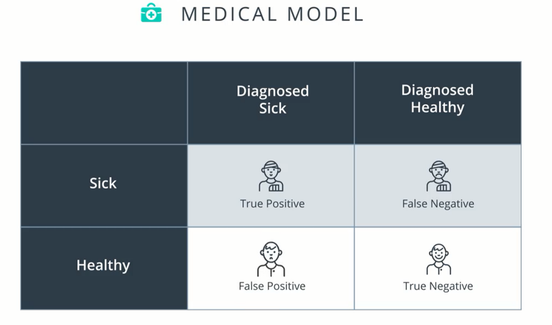
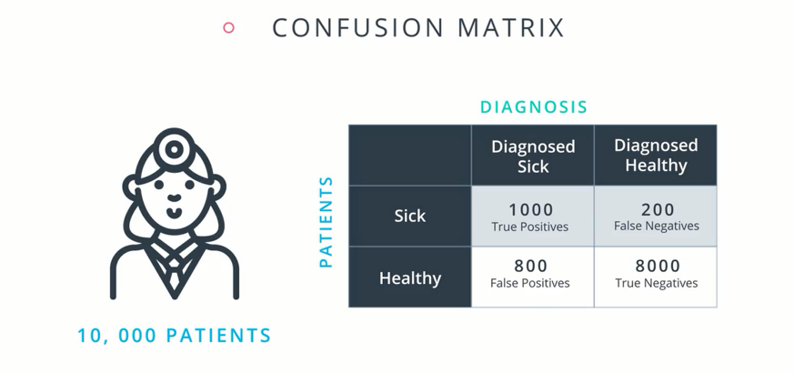
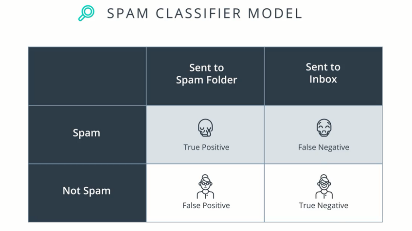
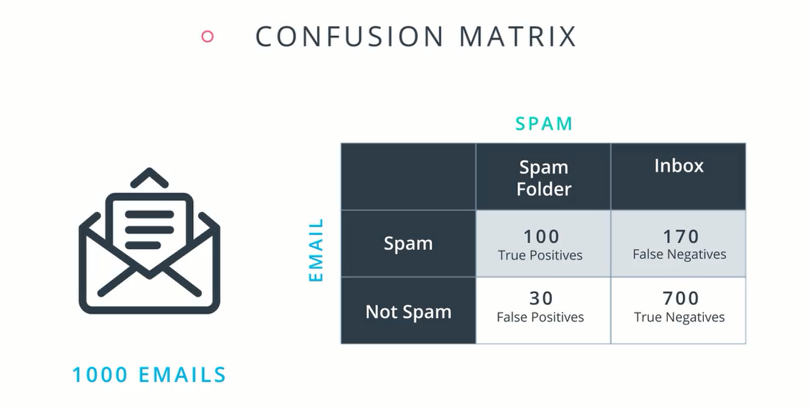
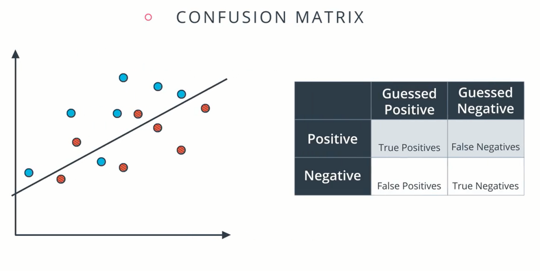

>### 混淆矩阵

开发模型之后，想知道它的性能如何，我们将学习一些不同的指标，通过它们来了解模型的性能。

**示例一**：检测特定疾病，判断就诊者是患病还是健康

混淆矩阵是一个描述模型性能的表，用于存储值

**示例二**：垃圾邮件检测器，帮助我们确定电子邮件是否为垃圾邮件

混淆矩阵

**混淆矩阵练习**
蓝点表示 positive，红点表示 negative，模型为分割两点的线。

上述模型中有多少个 True Positive、True Negative、False Positives 和 False Negative ？

(6,5,2,1)
